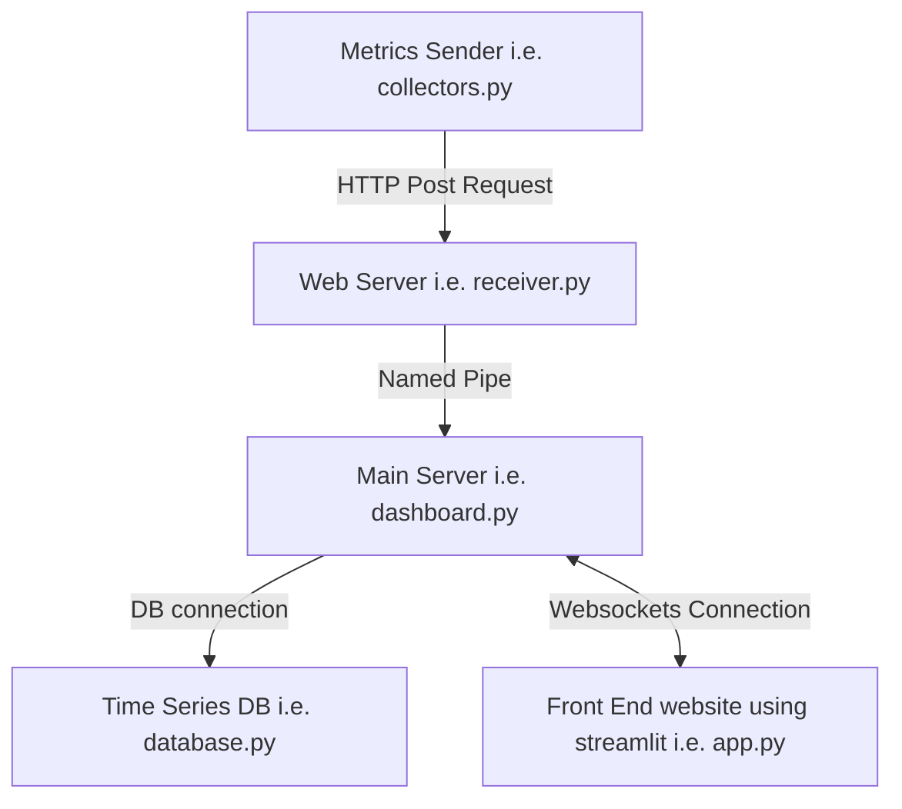

# [COP-3604 Linux Infrastructure Observability Dashboard Project](https://github.com/nickolasddiaz/COP-3604-Linux-Infrastructure-Observability-Dashboard-Project)

This a group project from Fall 2026 COP3604 – System Administration using unix at Florida Polytechnic University taught by professor Christian Navarro

## Objective

Design, implement, and evaluate a performance monitoring solution for a remote, cloud-based Linux infrastructure based on number real-world stresses that affect production servers.

## Instalation

### Prerequisites

Python 3.14 or later

## Files

```bash
COP-3604 Linux Infrastructure Observability Dashboard Project/$ tree -F
├── app.py           # Streamlit web app
├── collectors.py    # Collects performance metrics and sends data to receiver
├── dashboard.py     # Spawns Streamlit app, named_pipe connections, and web receiver
├── database.csv     # TinyFluxDB DB file
├── database.py      # TinyFluxDB wrapper to store, insert, and query metrics
├── metrics.py       # Enum for metric types
├── named_pipe.py    # Named pipe wrapper to share data between processes
├── receiver.py      # Starts web server to collect metrics and pipe them forward
└── requirements.txt # List of required packages
```

## Diagram




### Step-by-Step Guide

1. **Clone the repository**

   ```bash
   git clone https://github.com/nickolasddiaz/COP-3604-Linux-Infrastructure-Observability-Dashboard-Project.git
   cd project-name
   ```

2. **Create environment**

    ```bash
   python3 -m venv .venv
   source .venv/bin/activate
    ```

3. **Install dependencies**

   ```bash
   pip3 install -r requirements.txt
   ```

4. **Run the collectors**

   ```bash
   python3 collectors.py
   ```

5. **Run the Main server**

   ```bash
   streamlit run dashboard.py
   ```

## Contributers

Jordan Baumann, Nickolas Diaz, Sydney Prall, Andres Saldarriaga

## Requirements

- **Cloud-Based Deployment:** A VPC and Ubuntu or Debian Linux server vm must be deployed to the Google Cloud Platform.
- **Simulated Load:** The utility stress-ng will be deployed in a custom bash script that will alternately generate high loads of differing time intervals and differing classes (i.e. CPU, io, filesystem, memory, etc.). You may optionally select five (5) classes to stress.
- **Systemd:** Create a systemd service for the stress-ng script that will automatically start as a service whenever server is rebooted. The service to be configured with Restart=always and a WatchdogSec parameter to handle crashes.
- **API/Agent:** Create an agent and/or API to allow a remote monitoring solution to collect system statistics (i.e. memory usage, CPU usage, etc.). You may choose five (5) parameters to monitor and collect. The API or Agent should be custom designed and can be developed with Bash, Python, or any other language.
- **Named Pipes:** Utilized named pipes in your solution and identify how they are used in your report.
- **Users and Groups:** Create a unique user and/or group assigned to your API/Agent.
- **Remote Monitoring:** Dashboard GUI must remotely monitor performance metrics of Linux servers. Dashboards must be custom designed and can be developed with Bash, Python, or any other language. You may use existing libraries such as Django, tKinter or plotly. Dashboard may run from your laptop, personal computer, or another GCP virtual machine.
- **Key Performance Metrics:** Monitor essential metrics (i.e. CPU, memory, disk, network – total of five (5)).
- **Data Visualization:** Dashboard must visually represent performance data using appropriate charts and graphs (real-time and historical data).
- **Data Collection Automation:** Data collection from the monitored server(s) must be automated (scripted) by starting the app on laptop.
- **Notification System:** based on performance thresholds. Provide user adjustable thresholds to notify user if threshold is surpassed. This can be a message box or color change in the dashboard.
- **Security:** Implement a firewall, iptables, or VPC configuration to limit agent/api access to a single IP address.
- **Failure Handling:** Implement appropriate failure handling mechanisms to monitor the operation of agent or Api to restart automatically. Use a cron job to check their status every 5 minutes
- **Version Control:** Use a Git or GitHub repository to manage version control for all code development branches and collaboration. All team members will have access to the repository and make meaningful updates to the code base reflected by numerous commits. The commits should tell a story about progress.
- **Multiple Servers:** Each group member must be responsible for a cloud-based server deployment. If two students work together, then there will be two servers and one dashboard. For three students, then have three servers and one dashboard.
