# System Diagram.vsdx

**Total Images Found**: 0

## Pages (1 total)

### Page 1: Page-1

#### Diagram

```mermaid
graph TD
    Metrics_Fetcher["Metrics Fetcher"]
    Main_Server__Streamlit_as_a_web_app["Main Server

Streamlit as a web app"]
    Time_series_data_DB["Time series data DB"]
    Front_end_website_built_with_streamlit_library["Front end website built with streamlit library"]
    TinyFlux_DB_Connection["TinyFlux DB
Connection"]
    HTTP_Post_Request["HTTP Post Request"]
    HTTP_Connection["HTTP
Connection"]
    Web_Server_to_Catch_requests_and_send_them_to_FIFO["Web Server to
Catch requests and send them to FIFO"]
    Named_Pipe___FIFO_["Named
Pipe  (FIFO)"]

    %% Hierarchical structure (inferred)
```

#### Detailed Shape Information

**Total shapes**: 19

##### Shape 1
- **Sub-shapes**: 18
  - Metrics Fetcher
  - Main Server

Streamlit as a web app
  - Time series data DB
  - Front end website built with streamlit library
  - TinyFlux DB
Connection
  - HTTP Post Request
  - HTTP
Connection
  - Web Server to
Catch requests and send them to FIFO
  - Named
Pipe  (FIFO)
  - Metrics Fetcher
  - Main Server

Streamlit as a web app
  - Time series data DB
  - Front end website built with streamlit library
  - TinyFlux DB
Connection
  - HTTP Post Request
  - HTTP
Connection
  - Web Server to
Catch requests and send them to FIFO
  - Named
Pipe  (FIFO)

##### Shape 2
- **Text**: Metrics Fetcher
- **ID**: 1

##### Shape 3
- **Text**: Main Server

Streamlit as a web app
- **ID**: 2

##### Shape 4
- **Text**: Time series data DB
- **ID**: 3

##### Shape 5
- **Text**: Front end website built with streamlit library
- **ID**: 4

##### Shape 6
- **Text**: TinyFlux DB
Connection
- **ID**: 5

##### Shape 7
- **Text**: HTTP Post Request
- **ID**: 7

##### Shape 8
- **Text**: HTTP
Connection
- **ID**: 8

##### Shape 9
- **Text**: Web Server to
Catch requests and send them to FIFO
- **ID**: 1000

##### Shape 10
- **Text**: Named
Pipe  (FIFO)
- **ID**: 1001

##### Shape 11
- **Text**: Metrics Fetcher
- **ID**: 1

##### Shape 12
- **Text**: Main Server

Streamlit as a web app
- **ID**: 2

##### Shape 13
- **Text**: Time series data DB
- **ID**: 3

##### Shape 14
- **Text**: Front end website built with streamlit library
- **ID**: 4

##### Shape 15
- **Text**: TinyFlux DB
Connection
- **ID**: 5

##### Shape 16
- **Text**: HTTP Post Request
- **ID**: 7

##### Shape 17
- **Text**: HTTP
Connection
- **ID**: 8

##### Shape 18
- **Text**: Web Server to
Catch requests and send them to FIFO
- **ID**: 1000

##### Shape 19
- **Text**: Named
Pipe  (FIFO)
- **ID**: 1001
